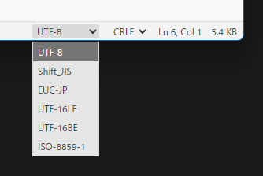
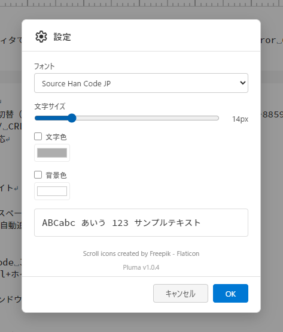
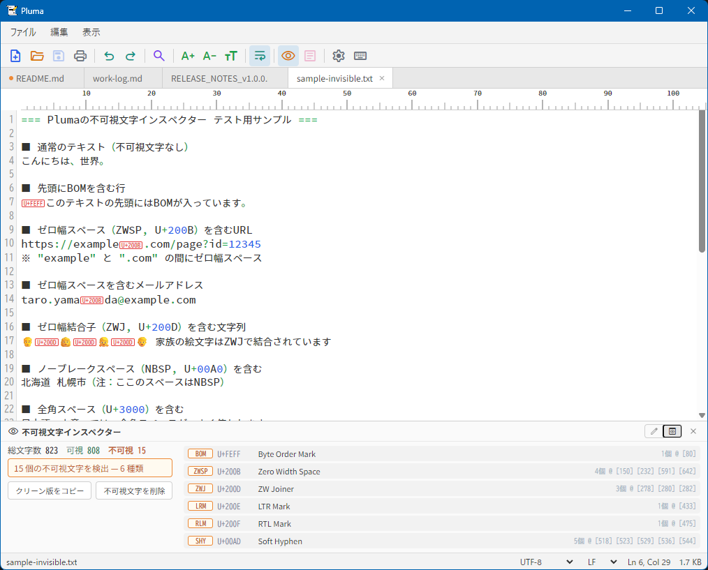
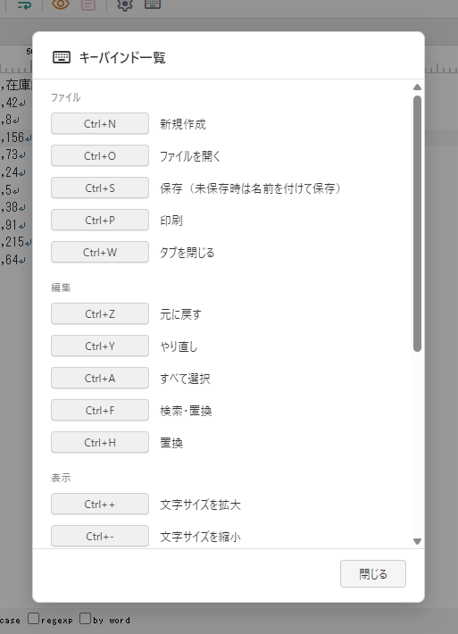

# Pluma User Guide

Pluma is a lightweight desktop text editor built with Tauri v2. It supports txt / csv / tsv / md files and features automatic encoding detection, an invisible character inspector, live Markdown preview, and more.

**Supported version: Pluma v1.0.4**

## Table of Contents

- [Introduction](#introduction)
- [Screen Layout](#screen-layout)
- [File Operations](#file-operations)
- [Encoding & Line Endings](#encoding--line-endings)
- [Tabs](#tabs)
- [Editing Features](#editing-features)
- [Find & Replace](#find--replace)
- [Display Customization](#display-customization)
- [CSV / TSV Editing](#csv--tsv-editing)
- [Markdown Preview](#markdown-preview)
- [Invisible Character Inspector](#invisible-character-inspector)
- [Printing / PDF Export](#printing--pdf-export)
- [Large Files](#large-files)
- [Keyboard Shortcuts](#keyboard-shortcuts)
- [FAQ](#faq)

---

## Introduction

### Pluma's Strengths

Pluma is a simple text editor optimized for the following uses:

- Editing Japanese text files with **conscious control over encoding and line endings**
- Editing CSV / TSV data **at the cell level**
- Writing Markdown with **real-time preview**
- Detecting and removing **invisible characters** (zero-width spaces, etc.) from pasted text
- Printing to PDF

> **Note:** Pluma is not a code editor (like VS Code) nor a word processor (like Word). It does not include language-specific syntax highlighting or document styling features.

### Supported Platforms

- Windows 10 / 11 (requires WebView2 runtime)
- macOS (Apple Silicon supported)

---

## Screen Layout


Pluma's UI consists of the following elements, from top to bottom:

| Position | Element | Description |
|----------|---------|-------------|
| Topmost | **Menu bar** | File / Edit / View menus |
| 2nd | **Toolbar** | Icon buttons for common actions (New, Open, Save, Print, Find, Preview toggle, etc.) |
| 3rd | **Tab bar** | Tabs for open files |
| Center | **Editor area** | Text editing area (CodeMirror 6-based) |
| Right (optional) | **Markdown preview panel** | Toggle with Ctrl+Shift+M |
| Bottom (optional) | **Invisible Character Inspector** | Toggle with Ctrl+Shift+I |
| Bottommost | **Status bar** | Filename, encoding, line ending, cursor position, file size |

### Editor Area Elements

- **Line numbers** — left gutter
- **Ruler** — character width scale at the top
- **Active line highlight** — background color for the current line
- **Whitespace visualization** — spaces, full-width spaces, tabs, and line breaks shown as symbols

### Status Bar


| Item | Description |
|------|-------------|
| **Filename** | Currently open file (unsaved: marked with `*`) |
| **Encoding** | Dropdown selector (UTF-8, Shift_JIS, etc.) |
| **Line ending** | Dropdown selector (LF / CRLF / CR) |
| **Cursor position** | `Ln X, Col Y` (line, column) |
| **Character count** | Shown only while text is selected: `文字数：N 文字` (half/full-width chars and newlines each count as 1) |
| **File size** | In KB or MB |

---

## File Operations

### New File

- **Ctrl+N** creates a new empty tab.
- The tab appears as "Untitled" until saved.

### Open File

Four methods:

1. **Ctrl+O** → select file in the file dialog
2. **Drag & drop** — drag a file onto the window
3. **File association** — double-click a file in Windows Explorer or Finder (requires setup)
4. **Right-click menu (Windows)** — right-click a `.txt / .csv / .tsv / .tab / .md / .htm / .html` file in Explorer and choose "Plumaで編集" (registered automatically by the installer)

When a file is opened, the **encoding and line ending are automatically detected**.

### Recent Files

**File > Open Recent** gives access to up to 10 recently opened files. Clicking one **opens it in a new tab** (current tabs are not closed).

### Save

| Action | Shortcut | Behavior |
|--------|----------|----------|
| Save | **Ctrl+S** | Overwrites existing file; prompts for location if new |

Tabs with unsaved changes show a **dot (●)** next to the filename.

### Close

- **Ctrl+W** — close the current tab
- **Alt+F4** — quit the app (prompts to save unsaved tabs)

When closing, a **Save / Discard / Cancel** confirmation dialog appears if there are unsaved changes.

---

## Encoding & Line Endings

### Automatic Detection

When opening a file, Pluma automatically detects the encoding, line ending, and presence of a BOM.

### Supported Encodings

- **UTF-8** (with / without BOM)
- **Shift_JIS**
- **EUC-JP**
- **UTF-16 LE** (with / without BOM)
- **UTF-16 BE** (with / without BOM)
- **ISO-8859-1**

### Supported Line Endings

| Line ending | Typical environment |
|-------------|---------------------|
| **LF** (`\n`) | macOS / Linux |
| **CRLF** (`\r\n`) | Windows |
| **CR** (`\r`) | Classic Mac (rarely used today) |

### Changing Encoding

Select a different encoding from the **status bar dropdown** to **re-read the file** with the new encoding.



> **Important:** This triggers a reload, so a confirmation dialog will appear if you have unsaved changes.

### Changing Line Endings

Selecting a line ending from the **status bar dropdown** converts the editor's line endings. **The new line ending is used when saving.**


---

## Tabs


- You can open **multiple files simultaneously** (no tab limit).
- Click a tab to **switch**.
- Click the `×` on a tab to **close it individually**.
- Opening the same file again **brings focus to the existing tab** (preventing duplicates).

---

## Editing Features

### Basic Editing

| Shortcut | Action |
|----------|--------|
| **Ctrl+Z** | Undo |
| **Ctrl+Y** | Redo |
| **Ctrl+X / C / V** | Cut / Copy / Paste |
| **Ctrl+A** | Select all |

### Rectangular Selection (Column Selection)

Use **Alt+drag** to select a rectangular area. Useful for editing columns in bulk.

### Multiple Cursors

When you type after making a rectangular selection, you can **type across multiple lines simultaneously**.

### Select Next Match

**Ctrl+D** adds the next occurrence of the currently selected text to the selection. Useful for editing multiple occurrences at once.

---

## Find & Replace

### Find

Press **Ctrl+F** to open the find bar.

Options:
- Case sensitive
- Regular expressions
- Whole word

### Replace

Press **Ctrl+H** to open the replace bar.


- **Replace** — replace one match at a time
- **Replace All** — replace all matches at once

---

## Display Customization

### Settings Dialog

Open settings from the toolbar or **View** menu.



| Item | Options |
|------|---------|
| **Font** | Source Han Code JP / MS Gothic / MS Mincho |
| **Font size** | 8–40px (slider with live preview) |
| **Text color** | Color picker or default |
| **Background color** | Color picker or default |
| **Wrap mode** | No wrap / Window width / Fixed column |
| **Column width** | Wrap column count (default 80) |

### Quick Font Size Adjustment

| Shortcut | Action |
|----------|--------|
| **Ctrl +** | Increase |
| **Ctrl -** | Decrease |
| **Ctrl 0** | Reset to default (14px) |
| **Ctrl + Mouse Wheel** | Zoom |

### View Menu Toggles

| Item | Description |
|------|-------------|
| **Show ruler** | Display character width scale |
| **Show line numbers** | Display line numbers in the left gutter |
| **Show whitespace** | Visualize spaces, full-width spaces, tabs, line breaks |
| **Highlight active line** | Color the background of the current line |


---

## CSV / TSV Editing

CSV editing mode is automatically enabled when opening `.csv`, `.tsv`, or `.tab` files.


### Automatic Delimiter Detection

Pluma automatically detects **comma / tab / semicolon** delimiters based on the file's content.

### Cell Navigation

| Key | Action |
|-----|--------|
| **Tab** | Next cell |
| **Shift+Tab** | Previous cell |

### Column Highlighting

A **1 px green vertical line** is drawn at the left edge of the currently-active column, making it easy to tell which column you are editing without conflicting with the text-selection background. The line stays continuous across rows — including empty cells and inter-line gaps.

### Character Counter

While a selection is active, the status bar shows **"文字数：N 文字"** on the right. Half-width, full-width, and newline characters are each counted as one character; multi-cursor and rectangular selections sum across all ranges.

---

## Markdown Preview

You can use Markdown preview when opening `.md` files or any text file.

### Show Preview

Press **Ctrl+Shift+M** to toggle the preview panel.


### Supported Markdown

- Headings (`#` through `######`)
- Bold (`**`) and italic (`*`)
- Lists (bullet, numbered, task lists)
- Tables
- Code blocks
- Blockquotes
- Images
- Links

### Preview Features

- **Real-time updates** — changes in the editor appear in the preview immediately
- **Scroll sync** — editor and preview scroll together
- **Resizable** — drag the panel divider to change width (200–1200px)
- **Width memory** — the panel width is restored on next launch

---

## Invisible Character Inspector

A signature feature of Pluma: **detect, visualize, and remove invisible characters** like zero-width spaces.

### Use Cases

- Remove unintended invisible characters from text pasted from the web
- Check for **zero-width spaces** in IDs, passwords, URLs, etc.
- Inspect and remove a **BOM (Byte Order Mark)** from a document

### Show Inspector

Press **Ctrl+Shift+I** to toggle the inspector panel.

### Detected Characters (25+ types)

| Category | Examples |
|----------|----------|
| Zero-width | Zero-width space (ZWSP), zero-width joiner (ZWJ), zero-width non-joiner (ZWNJ) |
| BOM | Byte Order Mark |
| Bidirectional control | LRM, RLM, LRE, RLE, PDF (directionality control) |
| C1 control chars | 0x80–0x9F range |
| Special spaces | No-break space, thin space |
| Other | Line/paragraph separator, variation selectors, soft hyphen |

### Two Modes

| Mode | Function |
|------|----------|
| **Edit mode** | Keep text as-is; show detection info in the panel |
| **Preview mode** | Overlay detected invisible characters as `U+XXXX` badges on the text |




### Statistics

The panel shows:

- Total character count
- Total invisible characters
- Count per invisible character type

### Cleanup Actions

- **Copy clean text** — copy a version of the text with all invisible characters removed
- **Delete all invisible** — remove all invisible characters from the editor at once

---

## Printing / PDF Export

Press **Ctrl+P** to export the current file as a **PDF**.

### Output Format

- Paper size: **A4**
- Header: **Filename** (center)
- Footer: **Print date/time** (left), **Page X/Y** (right)
- After generation, the PDF opens automatically in your OS's default PDF viewer

> **Note:** Direct printing to a printer is not supported. Print the generated PDF separately.

---

## Large Files

Pluma switches operating modes based on file size:

| Size | Behavior |
|------|----------|
| **Up to 50 MB** | Normal editing |
| **50–200 MB** | Warning dialog (may be slow) |
| **200 MB+** | **Read-only mode** (cannot edit; view and search only) |

---

## Keyboard Shortcuts

### File

| Shortcut | Action |
|----------|--------|
| **Ctrl+N** | New tab |
| **Ctrl+O** | Open file |
| **Ctrl+S** | Save |
| **Ctrl+P** | Print (PDF) |
| **Ctrl+W** | Close tab |
| **Alt+F4** | Quit app |

### Edit

| Shortcut | Action |
|----------|--------|
| **Ctrl+Z** | Undo |
| **Ctrl+Y** | Redo |
| **Ctrl+A** | Select all |
| **Ctrl+F** | Find |
| **Ctrl+H** | Replace |
| **Ctrl+D** | Select next match |
| **Alt+drag** | Rectangular selection |

### View

| Shortcut | Action |
|----------|--------|
| **Ctrl+ +** | Increase font size |
| **Ctrl+ -** | Decrease font size |
| **Ctrl+0** | Reset font size |
| **Ctrl + Mouse Wheel** | Zoom |
| **Ctrl+Shift+I** | Toggle Invisible Character Inspector |
| **Ctrl+Shift+M** | Toggle Markdown Preview |

### CSV / TSV

| Shortcut | Action |
|----------|--------|
| **Tab** | Next cell |
| **Shift+Tab** | Previous cell |

### Help

| Shortcut | Action |
|----------|--------|
| **F1** | Show keyboard shortcut reference |



---

## FAQ

### Q. OS warnings appear on first launch.

Pluma is not code-signed, so warnings appear on first launch.

**macOS:**
If you see "pluma is damaged and can't be opened" or "Cannot verify the developer," run in Terminal:

```
xattr -cr /Applications/pluma.app
```

**Windows:**
If SmartScreen shows "Windows protected your PC," click "More info" → "Run anyway."

### Q. Does Pluma support syntax highlighting for programming languages?

**No.** Pluma is intentionally not a code editor. Only minimal highlighting for `.md` files and CSV/TSV column highlighting are supported. For code, use VS Code, Sublime Text, Notepad++, etc.

### Q. Can I extend Pluma with plugins?

There is no plugin mechanism. Pluma is intentionally kept simple.

### Q. The encoding was detected incorrectly.

Automatic detection isn't always perfect. If the detection is wrong, select the correct encoding manually from the **status bar dropdown**. This triggers a re-read.

### Q. How did zero-width spaces get into my text?

Common sources include:

- Copy-pasting from websites (especially some social media, richly-formatted pages)
- Copy-pasting from document editors (Word, Google Docs)
- Specialized input methods

Use the Invisible Character Inspector (Ctrl+Shift+I) to detect and remove them.

### Q. My saved text shows mojibake (garbled characters).

Check the following:

1. The **encoding** in the status bar matches your intention
2. The target system supports the encoding used (e.g., older Windows software may require Shift_JIS)
3. The BOM setting matches what's expected (UTF-8 with BOM vs. without)

### Q. How do I edit very large files?

Files over 200MB open in **read-only mode**. To edit them, split the file first or use a different editor designed for large files.

### Q. Can I reorder tabs?

Tab reordering is not currently supported. Tabs stay in the order they were opened.

### Q. Where are my settings saved?

Settings like font, size, color, wrap mode, and panel widths are saved in **browser localStorage** and automatically restored on next launch.
