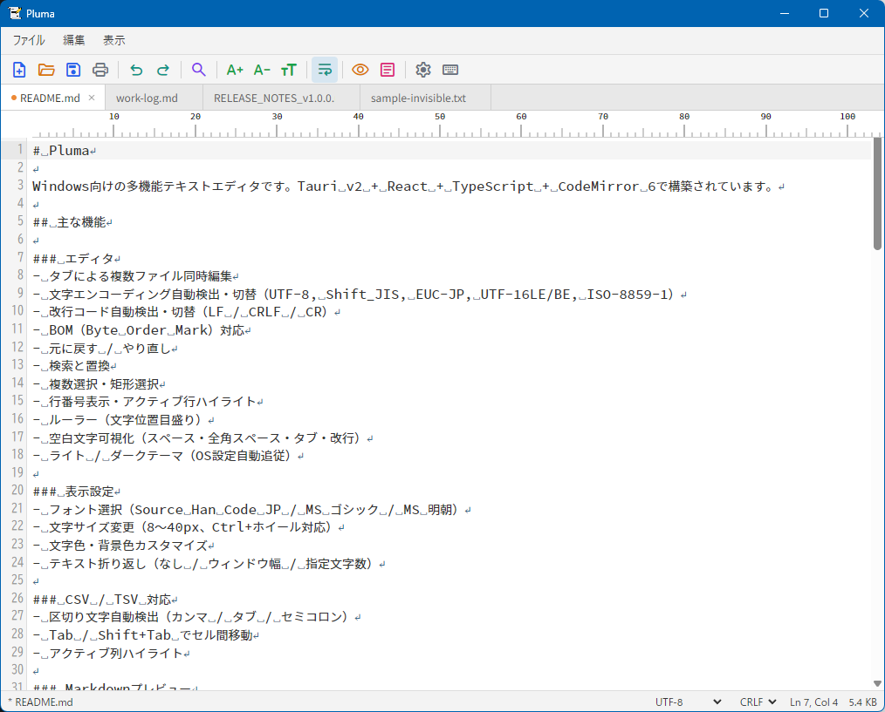
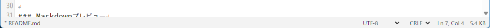
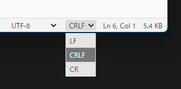
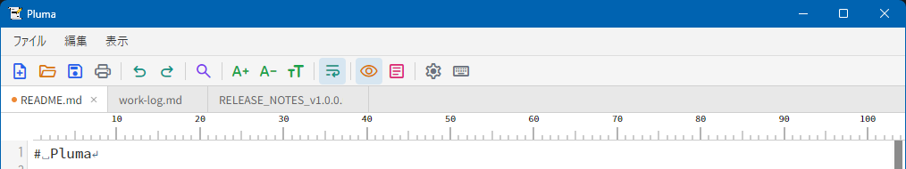
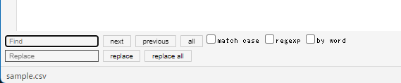
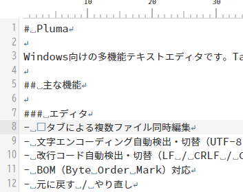
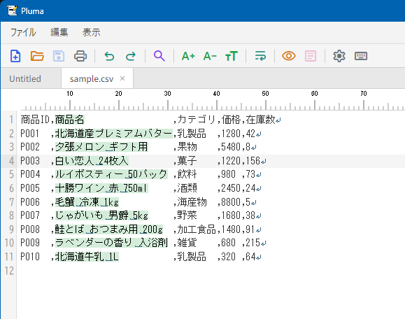
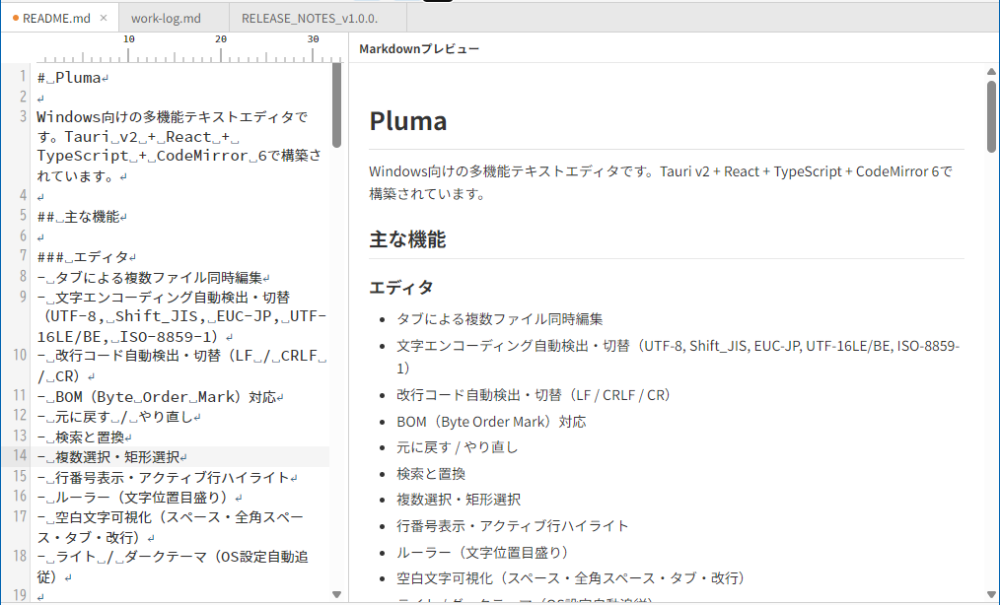
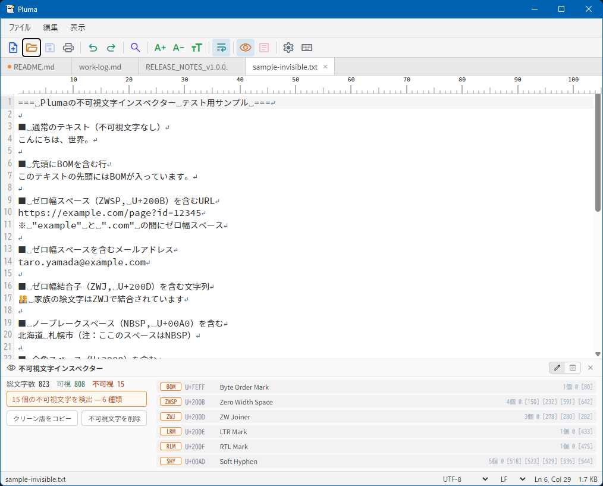

# Pluma 操作マニュアル

Pluma（プルマ）は、Tauri v2 製の軽量デスクトップテキストエディタです。txt / csv / tsv / md ファイルに対応し、文字コード自動判別、不可視文字インスペクター、Markdown プレビューなどの機能を搭載しています。

**対応バージョン: Pluma v1.0.4**

## 目次

- [はじめに](#はじめに)
- [画面の基本構成](#画面の基本構成)
- [ファイル操作](#ファイル操作)
- [文字コード・改行コード](#文字コード改行コード)
- [タブ操作](#タブ操作)
- [編集機能](#編集機能)
- [検索・置換](#検索置換)
- [表示カスタマイズ](#表示カスタマイズ)
- [CSV / TSV 編集](#csv--tsv-編集)
- [Markdown プレビュー](#markdown-プレビュー)
- [不可視文字インスペクター](#不可視文字インスペクター)
- [印刷・PDF 出力](#印刷pdf-出力)
- [大容量ファイルの扱い](#大容量ファイルの扱い)
- [キーボードショートカット](#キーボードショートカット)
- [よくある質問](#よくある質問)

---

## はじめに

### Pluma の特徴

Pluma は、以下のような用途に最適化されたシンプルなテキストエディタです。

- 日本語のテキストファイルを **文字コード・改行コードを意識しながら** 編集
- CSV / TSV データの **セル単位での編集**
- Markdown ファイルの **リアルタイムプレビュー** 付きで執筆
- コピペしたテキストに混入した **ゼロ幅スペースなどの不可視文字** を検出・除去
- PDF への印刷出力

> **補足:** Pluma はコードエディタ（VSCode等）やワードプロセッサ（Word等）ではありません。プログラミング言語ごとの構文ハイライトやドキュメント装飾機能は搭載していません。

### 対応 OS

- Windows 10 / 11（WebView2 ランタイムが必要）
- macOS（Apple Silicon 対応）

---

## 画面の基本構成



Pluma の画面は、上から下に向かって以下の要素で構成されます。

| 位置 | 要素 | 説明 |
|------|------|------|
| 最上部 | **メニューバー** | ファイル / 編集 / 表示 のメニュー |
| 2段目 | **ツールバー** | よく使う操作のアイコンボタン（新規・開く・保存・印刷・検索・プレビュー切替など） |
| 3段目 | **タブバー** | 開いているファイルのタブ一覧 |
| 中央 | **エディタ領域** | テキスト編集領域（CodeMirror 6 ベース） |
| 右（任意） | **Markdown プレビューパネル** | Ctrl+Shift+M で表示 |
| 下（任意） | **不可視文字インスペクター** | Ctrl+Shift+I で表示 |
| 最下部 | **ステータスバー** | ファイル名・文字コード・改行コード・カーソル位置・ファイルサイズ |

### エディタ領域の要素

- **行番号** — 左端のガター
- **ルーラー** — 文字列幅の目盛り（上部）
- **カーソル行ハイライト** — 現在のカーソル行の背景色
- **空白の可視化** — スペース・全角スペース・タブ・改行を記号で表示

### ステータスバー



| 項目 | 説明 |
|------|------|
| **ファイル名** | 現在開いているファイル（未保存時は `*` 付き） |
| **文字コード** | ドロップダウンで切替可能（UTF-8、Shift_JIS 等） |
| **改行コード** | ドロップダウンで切替可能（LF / CRLF / CR） |
| **カーソル位置** | `Ln X, Col Y`（行・列） |
| **文字数** | 選択中のみ表示: `文字数：N文字`（半角・全角・改行をそれぞれ 1 文字としてカウント） |
| **ファイルサイズ** | KB または MB 単位 |

---

## ファイル操作

### 新規作成

- **Ctrl+N** で新しい空のタブを作成します。
- 未保存状態で「Untitled」と表示されます。

### ファイルを開く

以下の4通りの方法があります。

1. **Ctrl+O** → ファイルダイアログで選択
2. **ドラッグ&ドロップ** — ウィンドウにファイルをドラッグ
3. **ファイルの関連付け** — Windows エクスプローラや Finder からダブルクリック（事前に関連付け設定が必要）
4. **右クリックメニュー（Windows）** — エクスプローラーで `.txt / .csv / .tsv / .tab / .md / .htm / .html` ファイルを右クリックし「Plumaで編集」を選択（インストーラーが自動登録）

ファイルを開くと、**文字コードと改行コードが自動判別** されます。

### 最近使ったファイル

**ファイル > 最近使ったファイル** から、最近開いた最大10件のファイルにアクセスできます。クリックすると **新しいタブで開きます**（現在のタブは閉じられません）。

### 保存

| 操作 | ショートカット | 動作 |
|------|----------------|------|
| 保存 | **Ctrl+S** | 既存ファイルは上書き、新規ファイルは保存先ダイアログを表示 |

未保存の変更があるタブは、タブ名の横に **点（●）** が表示されます。

### 閉じる

- **Ctrl+W** — 現在のタブを閉じる
- **Alt+F4** — アプリ終了（未保存のタブがあれば確認ダイアログ）

閉じる操作時、未保存の変更があれば **保存 / 破棄 / キャンセル** の確認ダイアログが表示されます。

---

## 文字コード・改行コード

### 自動判別

ファイルを開くと、Pluma は自動で文字コード・改行コード・BOMの有無を判別します。

### 対応文字コード

- **UTF-8**（BOM付き / なし）
- **Shift_JIS**
- **EUC-JP**
- **UTF-16 LE**（BOM付き / なし）
- **UTF-16 BE**（BOM付き / なし）
- **ISO-8859-1**

### 対応改行コード

| 改行コード | 主な使用環境 |
|-----------|--------------|
| **LF** (`\n`) | macOS / Linux |
| **CRLF** (`\r\n`) | Windows |
| **CR** (`\r`) | 旧 Mac（現在ではほぼ使われない） |

### 文字コードの変換

ステータスバーの **文字コード ドロップダウン** から別の文字コードを選ぶと、**ファイルを再読み込み** します。


> **重要:** 再読み込みのため、編集中の未保存変更があると確認ダイアログが表示されます。

### 改行コードの変換

ステータスバーの **改行コード ドロップダウン** から選択すると、エディタ内の改行コードが変換されます。**保存時に新しい改行コードでファイルが書き込まれます。**



---

## タブ操作



- 複数のファイルを **同時に開く** ことができます（タブ数に制限なし）。
- タブをクリックで **切り替え**。
- タブの `×` ボタンで **個別にタブを閉じる**。
- 同じファイルを2回開こうとした場合、**既存のタブにフォーカスを移動** します（重複を防ぎます）。

---

## 編集機能

### 基本編集

| ショートカット | 操作 |
|----------------|------|
| **Ctrl+Z** | 元に戻す（Undo） |
| **Ctrl+Y** | やり直し（Redo） |
| **Ctrl+X / C / V** | 切り取り / コピー / 貼り付け |
| **Ctrl+A** | すべて選択 |

### 矩形選択（列選択）

**Alt+ドラッグ** で矩形領域を選択できます。列単位で一括編集したい場合に便利です。

### 複数カーソル

矩形選択した状態で入力すると、**複数の行に同時に入力** できます。

### 次の一致を選択

**Ctrl+D** で、現在選択している語句の次の出現箇所を追加選択します。複数箇所を同時編集したい場合に便利です。

---

## 検索・置換

### 検索

**Ctrl+F** で検索バーが開きます。

- 大文字小文字の区別
- 正規表現
- 単語単位のマッチ

の各オプションが切り替え可能です。

### 置換

**Ctrl+H** で置換バーが開きます。



- **置換** — 1件ずつ置換
- **すべて置換** — 一括で置換

---

## 表示カスタマイズ

### 設定ダイアログ

ツールバーまたは **表示** メニューから設定ダイアログを開きます。


| 項目 | 選択肢 |
|------|--------|
| **フォント** | Source Han Code JP / MS ゴシック / MS 明朝 |
| **フォントサイズ** | 8〜40px（スライダー、リアルタイムプレビュー） |
| **文字色** | カラーピッカーまたはデフォルト |
| **背景色** | カラーピッカーまたはデフォルト |
| **折り返しモード** | 折り返さない / ウィンドウ幅で折り返し / 指定桁で折り返し |
| **指定桁数** | 折り返し桁数（デフォルト80文字） |

### フォントサイズのクイック調整

| ショートカット | 操作 |
|----------------|------|
| **Ctrl + +** | 拡大 |
| **Ctrl + -** | 縮小 |
| **Ctrl + 0** | 標準サイズ（14px）にリセット |
| **Ctrl + マウスホイール** | 拡大・縮小 |

### 表示メニューのトグル

| 項目 | 説明 |
|------|------|
| **ルーラーを表示** | 文字幅の目盛りを表示 |
| **行番号を表示** | 左ガターに行番号を表示 |
| **空白を表示** | スペース・全角スペース・タブ・改行を可視化 |
| **カーソル行をハイライト** | 現在の行の背景を色付け |



---

## CSV / TSV 編集

`.csv` `.tsv` `.tab` ファイルを開くと、CSV 編集モードが自動で有効になります。



### 区切り文字の自動判別

ファイル内容から、**カンマ / タブ / セミコロン** を自動判別します。

### セル間の移動

| キー | 操作 |
|------|------|
| **Tab** | 次のセルへ |
| **Shift+Tab** | 前のセルへ |

### 列のハイライト

現在編集中のセルの **列の左端に 1px の緑の縦連続線** が表示され、どの列を編集中か一目で把握できます。テキスト選択（薄緑の背景色）と被らない描画方式なので、選択範囲との視認性が両立します。空セルや行間も途切れない連続線として表示されます。

### 文字数カウンタ

範囲選択中はステータスバー右側に **「文字数：N文字」** が表示されます。半角・全角・改行を 1 文字としてカウントし、複数選択（矩形選択や Ctrl+D による複数選択）の場合は合計値を表示します。

---

## Markdown プレビュー

`.md` ファイルを開いたときや、任意のファイルで Markdown プレビューを利用できます。

### プレビューの表示

**Ctrl+Shift+M** でプレビューパネルの表示/非表示を切り替えます。



### 対応する Markdown 記法

- 見出し（`#` 〜 `######`）
- 太字（`**`）・斜体（`*`）
- リスト（箇条書き・番号付き・タスクリスト）
- 表（table）
- コードブロック
- 引用（blockquote）
- 画像
- リンク

### プレビュー機能

- **リアルタイム更新** — 左側の編集内容が即座にプレビューに反映
- **スクロール同期** — エディタとプレビューが連動してスクロール
- **リサイズ可能** — パネル境界をドラッグして幅を変更（200〜1200px）
- **幅の記憶** — 次回起動時も前回のパネル幅が復元

---

## 不可視文字インスペクター

Pluma の特徴的な機能で、**ゼロ幅スペースなどの目に見えない文字** を検出・可視化・除去できます。

### 使いどころ

- Web からコピペしたテキストの意図しない不可視文字を除去
- ID・パスワード・URL 等のテキストに混入した **ゼロ幅スペース** の確認
- 文章の **BOM（Byte Order Mark）** の確認・削除

### 表示方法

**Ctrl+Shift+I** でインスペクターパネルの表示/非表示を切り替えます。

### 検出できる不可視文字（25種類以上）

| 分類 | 例 |
|------|----|
| ゼロ幅系 | ゼロ幅スペース（ZWSP）、ゼロ幅結合子（ZWJ）、ゼロ幅非結合子（ZWNJ） |
| BOM | バイトオーダーマーク |
| 双方向制御 | LRM、RLM、LRE、RLE、PDF（双方向の記述方向制御） |
| C1 制御文字 | 0x80〜0x9F の範囲 |
| 特殊空白 | ノーブレークスペース、細幅スペース |
| その他 | 行/段落区切り、異体字セレクタ、ソフトハイフン |

### 2つのモード

| モード | 機能 |
|--------|------|
| **編集モード** | 本文はそのまま、下部パネルに検出情報のみ表示 |
| **プレビューモード** | 本文の不可視文字を `U+XXXX` 形式のバッジで可視化 |




### 統計情報

パネル上部に、以下の情報が表示されます。

- 総文字数
- 不可視文字の総数
- 種類別の検出数

### クリーンアップ操作

- **クリーンテキストをコピー** — 不可視文字を除いた状態のテキストをクリップボードへコピー
- **すべての不可視文字を削除** — エディタ上のすべての不可視文字を一括削除

---

## 印刷・PDF 出力

**Ctrl+P** で現在のファイルを **PDF ファイルとして出力** できます。

### 出力形式

- 紙サイズ：**A4**
- ヘッダー：**ファイル名**（中央揃え）
- フッター：**印刷日時**（左）・**ページ X/Y**（右）
- 出力完了後、OS 既定の PDF ビューアで自動的に開きます

> **補足:** 紙への直接印刷はできません。出力された PDF を別途印刷してください。

---

## 大容量ファイルの扱い

Pluma はファイルサイズに応じて動作モードを切り替えます。

| サイズ | 動作 |
|--------|------|
| **〜50 MB** | 通常編集可能 |
| **50〜200 MB** | 警告ダイアログを表示（動作が遅くなる可能性） |
| **200 MB〜** | **読み取り専用モード**（編集不可、閲覧・検索のみ可能） |

---

## キーボードショートカット

### ファイル操作

| ショートカット | 操作 |
|----------------|------|
| **Ctrl+N** | 新規タブ |
| **Ctrl+O** | ファイルを開く |
| **Ctrl+S** | 保存 |
| **Ctrl+P** | 印刷（PDF 出力） |
| **Ctrl+W** | タブを閉じる |
| **Alt+F4** | アプリ終了 |

### 編集

| ショートカット | 操作 |
|----------------|------|
| **Ctrl+Z** | 元に戻す |
| **Ctrl+Y** | やり直し |
| **Ctrl+A** | すべて選択 |
| **Ctrl+F** | 検索 |
| **Ctrl+H** | 置換 |
| **Ctrl+D** | 次の一致を選択 |
| **Alt+ドラッグ** | 矩形選択 |

### 表示

| ショートカット | 操作 |
|----------------|------|
| **Ctrl+ +** | フォント拡大 |
| **Ctrl+ -** | フォント縮小 |
| **Ctrl+0** | フォントサイズをリセット |
| **Ctrl+マウスホイール** | 拡大・縮小 |
| **Ctrl+Shift+I** | 不可視文字インスペクターの表示切替 |
| **Ctrl+Shift+M** | Markdown プレビューの表示切替 |

### CSV / TSV

| ショートカット | 操作 |
|----------------|------|
| **Tab** | 次のセル |
| **Shift+Tab** | 前のセル |

### ヘルプ

| ショートカット | 操作 |
|----------------|------|
| **F1** | キーボードショートカット一覧を表示 |


---

## よくある質問

### Q. 初回起動時に OS の警告が表示されます

Pluma はコード署名に対応していないため、初回起動時に警告が表示されます。

**macOS:**
「pluma は壊れているため開けません」または「開発元を確認できません」と表示された場合、ターミナルで以下を実行してください：

```
xattr -cr /Applications/pluma.app
```

**Windows:**
SmartScreen の警告「Windows によって PC が保護されました」が表示された場合、「詳細情報」→「実行」をクリックしてください。

### Q. プログラミング言語の構文ハイライトには対応していますか

Pluma は **コードエディタではない** ため、プログラミング言語の構文ハイライトには対応していません。`.md` ファイルの簡易ハイライトと CSV / TSV の列ハイライトのみが動作します。コード編集には VS Code、Sublime Text、Notepad++ などをお使いください。

### Q. プラグインで機能を拡張できますか

現在のところ、プラグイン機構は提供していません。Pluma は意図的にシンプルな設計を保つことを優先しています。

### Q. 文字コードが意図しないものに判別されます

自動判別は完璧ではありません。判別が正しくない場合は、ステータスバーの **文字コードドロップダウン** で手動指定してください。指定すると再読み込みが行われます。

### Q. ゼロ幅スペースが本文に混入したのはなぜですか

主に以下の経路で混入することがあります：

- Web サイトからのコピペ（特に一部の SNS、書式のあるページ）
- ドキュメントエディタ（Word、Google Docs）からのコピペ
- 特殊な入力メソッド

不可視文字インスペクター（Ctrl+Shift+I）で検出・除去できます。

### Q. 保存時に文字化けしました

以下を確認してください：

1. ステータスバーの **文字コード** が意図通りに設定されているか
2. 保存先のシステムが対応する文字コードで保存しているか（例：古い Windows ソフトは Shift_JIS を要求）
3. BOM の有無が期待通りか（UTF-8 with BOM か UTF-8 without BOM か）

### Q. 大きなファイルを編集したい

200MB 以上のファイルは **読み取り専用モード** で開かれます。編集したい場合は、ファイルを分割するか、他の大容量ファイル対応エディタをご利用ください。

### Q. タブの順番を並び替えたい

現在のバージョンでは、タブの並び替えには対応していません。タブは開いた順に固定されます。

### Q. 設定はどこに保存されますか

フォント、サイズ、色、折り返しモード、パネル幅などの設定は **ブラウザの localStorage** に保存され、次回起動時に自動復元されます。
